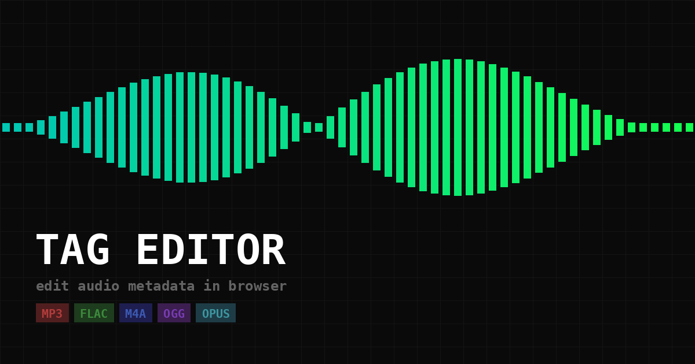

# Tag Editor

**Edit audio metadata directly in your browser. No upload, no server — all local.**

→ **[wendy.monster/tag-editor](https://wendy.monster/tag-editor/)**



---

## Supported Formats

| Format | Extension | Notes |
|--------|-----------|-------|
| MP3 | `.mp3` | ID3v2 tags, USLT lyrics frames, COMM comments |
| FLAC | `.flac` | Vorbis comment blocks |
| M4A / AAC | `.m4a` | iTunes atoms (`©nam`, `©ART`, etc.) |
| M4A / ALAC | `.m4a` | Same iTunes atoms, lossless codec |
| Ogg Vorbis | `.ogg` | Vorbis comment headers |
| Opus | `.opus` | OpusTags comment headers |

---

## Features

- **Pure client-side** — files never leave your device
- **Human-readable field names** — MP3's `TIT2`, `TPE1`, `TRCK` become Title, Artist, Track Number, etc.
- **Multiline lyrics** — newlines preserved on read, edit, and save across all formats
- **Inline field editing** with full-text modal for long values (lyrics, descriptions)
- **Add / remove fields** freely, including custom tags
- **Filename template** — auto-generates a clean filename from tags on save
- **Audio info panel** — codec, bitrate, sample rate, channels, duration
- **Drag & drop** or click to open
- **PWA** — installable as a home screen app on iOS and Android
- **Mobile-friendly** — works on phone, no pinch-zoom issues

---

## How It Works

All parsing and writing is done in JavaScript with no external libraries or server calls.

### Format Internals

**MP3 (ID3v2)**
Reads the `ID3` header, walks frame-by-frame. Text frames (`T*`) are decoded with the frame's encoding byte (Latin-1, UTF-16, UTF-8). `USLT` (lyrics) and `COMM` (comments) get special handling to skip their language + descriptor prefix. On write, frames are re-serialized with UTF-8 encoding and a fresh ID3v2.3 header.

**FLAC**
Reads metadata blocks sequentially from the stream. Finds the `VORBIS_COMMENT` block (type 4), parses little-endian length-prefixed `KEY=value` strings. Writes back by rebuilding only the comment block while leaving all other metadata blocks (STREAMINFO, SEEKTABLE, PICTURE, etc.) intact.

**M4A / AAC / ALAC**
Walks the MP4 atom tree to find `moov → udta → meta → ilst`. Maps iTunes atoms (`©nam`, `©ART`, `aART`, `©lyr`, etc.) to human-readable names. Writes a new `ilst` subtree back into the atom structure.

**Ogg Vorbis / Opus**
Parses the Ogg page structure (OggS magic bytes, segment tables, CRC32). Detects stream type by BOS page magic (`\x01vorbis` vs `OpusHead`). Extracts the comment header (page 1), parses Vorbis comment format (little-endian length-prefixed UTF-8 strings). On save, reconstructs page 1 with the new comment packet and recalculates CRC32 checksums.

---

## Field Name Mapping

MP3 ID3 frame IDs are translated to friendly names for display:

| ID3 Frame | Display Name |
|-----------|--------------|
| `TIT2` | Title |
| `TPE1` | Artist |
| `TALB` | Album |
| `TRCK` | Track Number |
| `TPOS` | Disc Number |
| `TDRC` | Year |
| `TCON` | Genre |
| `TCOM` | Composer |
| `TPE2` | Album Artist |
| `TPUB` | Label |
| `TSRC` | ISRC |
| `COMM` | Comment |
| `USLT` | Lyrics |
| `TXXX` | Custom (prefixed) |

FLAC, Ogg, and Opus use plain text keys (already human-readable). M4A atoms are mapped similarly.

---

## Running Locally

Just open `index.html` in a browser — no build step, no dependencies.

```bash
git clone https://github.com/monsterwendy/tag-editor.git
cd tag-editor
open index.html   # macOS
# or: python3 -m http.server 8080 && open http://localhost:8080
```

---

## License

MIT
